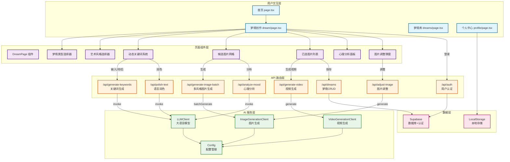
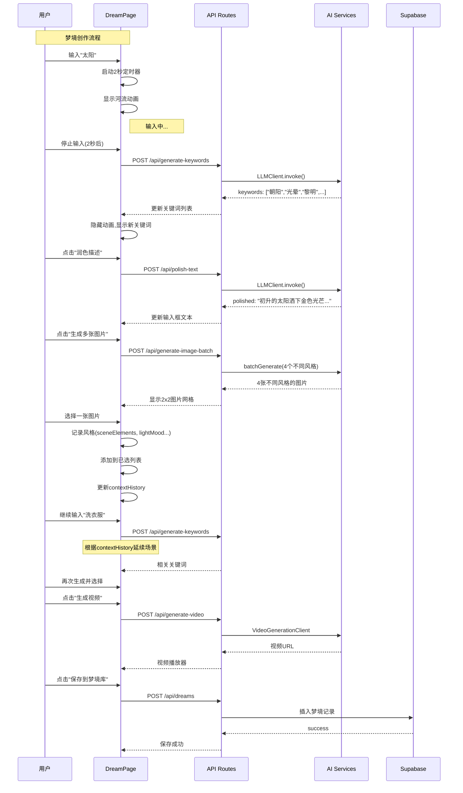
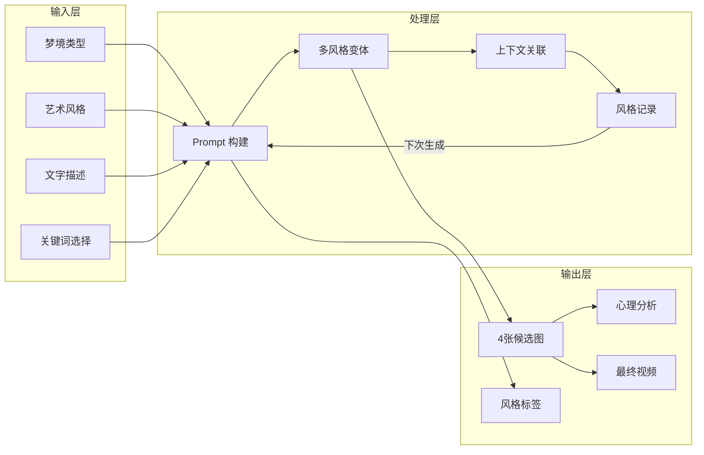
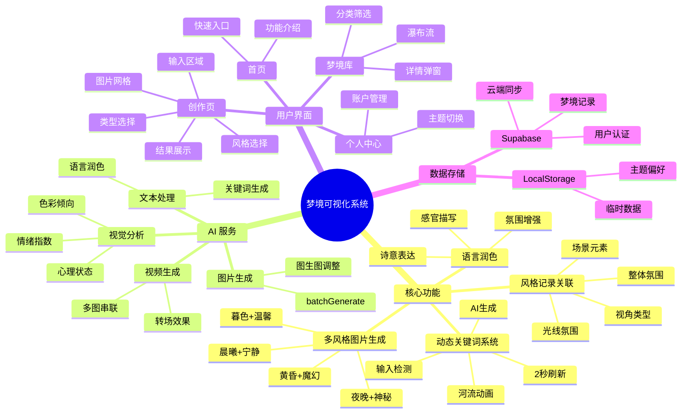

# 梦境可视化系统 - 架构图

---

---

---

---

## 架构图说明

| 图类型 | 内容 |
|--------|------|
| **Mermaid Graph** | 展示系统各层的模块划分和调用关系 |
| **Sequence Diagram** | 展示用户创作梦境的完整交互流程 |
| **Flow Graph** | 展示输入→处理→输出的数据流 |
| **Mind Map** | 展示系统功能的思维导图结构 |

所有图表已集成到此文档中，可以直接在任何支持 Mermaid 的 Markdown 预览工具中查看（如 VS Code + Mermaid 插件、GitHub、Notion 等）。
